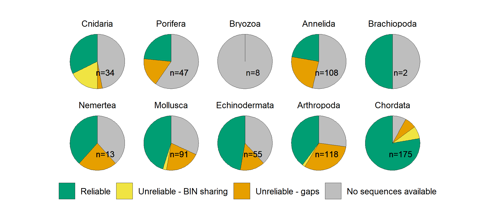
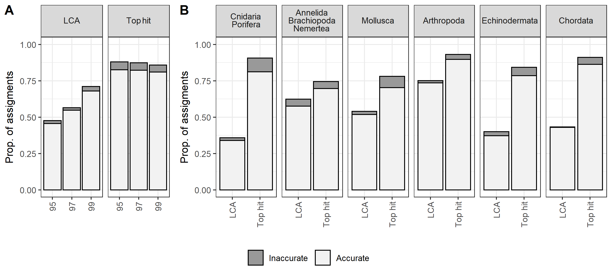
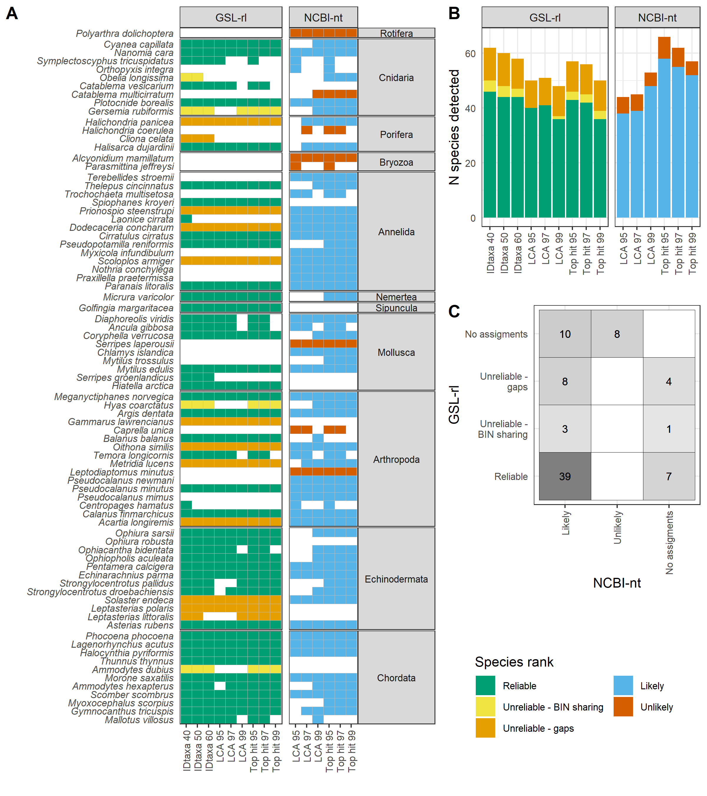

# Manuscript repository for:  Maximizing the reliability and the number of species assignments in metabarcoding studies

__Main author:__  Audrey Bourret  
__Affiliation:__  Fisheries and Oceans Canada (DFO)   
__Group:__        Laboratory of genomics   
__Location:__     Maurice Lamontagne Institute  
__Affiliated publication:__  Bourret, A., Nozères, C., Parent, É., Parent, G.J. (2022). [Maximizing the reliability and the number of species assignments in metabarcoding studies](https://www.biorxiv.org/content/10.1101/2022.11.17.513905v1). bioRxiv 2022.11.17.513905; doi: https://doi.org/10.1101/2022.11.17.513905  
__Contact:__      audrey.bourret@dfo-mpo.g  
__Contact:__      audrey.bourret@dfo-mpo.gc.ca

- [Objective](#objective)
- [Status](#status)
- [Contents](#contents)
- [Main Results](#main-results)
- [Caveats](#caveats)
- [Acknowledgements](#acknowledgements)
- [References](#references)

## Objective

The objective of this study was to estimate the accuracy of species assignments using a public repository (NCBI-nt) and identified the methods that were optimal with a public repository or a regional library. In this repository, you will find R scripts and results associated with the manuscript.

## Status

"Ongoing-improvements"

## Contents

### Folder structure

    .
    ├── 01_Raw_data        # Datasets used in the manuscripts
    ├── 02_R_scripts       # R scripts 
    ├── 03_Results         # Main figures    
    └── README.md

### Datasets

- [GSL_included_taxa.csv](./01_Raw_data/GSL_included_taxa.csv): Ranking category for the GSL-rl v1.0.
- [MS_AllAssignments.csv](./01_Raw_data/MS_AllAssignments.csv): Taxonomic assignment results for the real metabarcoding dataset, using ncbi-nt or gsl-rl, and 3 different methods. 
- [MS_ESV_reads.csv](./01_Raw_data/MS_ESV_reads.csv): N reads associated with ASV observed within the real metabarcoding dataset.
- [MS_NCBI.TestAssignments.csv](./01_Raw_data/MS_NCBI.TestAssignments.csv): Taxonomic assignment results for the sequences comprised within gsl-rl, using ncbi-nt and 2 assignment methods.

## Main results

|  |
|:--:| 
| **Figure 2** Classification of 651 marine faunal species previously observed in the Gulf of St. Lawrence and included in the GSL-rl, by phylum. Species rank categories are based on the similarity and availability of sequences from local and close relative species.|

|  |
|:--:| 
| **Figure 3** Results of taxonomic assignment of sequences from the GSL-rl using NBCI-nt and Blast-LCA or Blast-TopHit methods. Panels A and B present the proportion of accurate and inaccurate species assignments. Results overall taxonomic groups at the three identity thresholds (95%, 97%, 99%; panel A) and by taxonomic group at the 97% threshold (panel B).|

|  |
|:--:| 
| **Figure 4** Results of taxonomic assignment at the species level for the metabarcoding dataset over the GSL-rl and NBCI-nt libraries using IDtaxa (confidence level: 40%, 50% and 60%) and Blast-LCA or Blast+TopHit (identity threshold: 95%, 97% and 99%). Panel A detailed the detections for each species, and panel B synthesize the number of species detections for each library and method. Panel C compared the species rank for all the species detected with the two libraries. Species rank categories are based based on the similarity and availability of sequences from local and close relative species for the GSL-rl and on the geographic or habitat plausibility for the NCBI-nt. |

## Caveats

NCBI-nt version used was downloaded on the 2020-10-23.

GSL-rl version used was v.1.0, and can be founded [here](https://github.com/GenomicsMLI-DFO/MLI_GSL-rl).

## Acknowledgements

We thank Grégoire Cortial and Jade Larivière for their inputs at the earlier stages of this study. We also thank Nick Jeffery for helpful comments on a previous version of the manuscript. 

## References

Murali A, Bhargava A, Wright ES (2018) IDTAXA: a novel approach for
accurate taxonomic classification of microbiome sequences. Microbiome 6:
140. <https://doi.org/10.1186/s40168-018-0521-5>

Nozères C (2017) Preliminary checklist of marine animal species of the
Gulf of St.-Lawrence, Canada, based on 4 sources.
<https://doi.org/10.13140/RG.2.2.10056.62727>

Wright ES (2016) Using DECIPHER v2.0 to analyze big biological sequence
data in R. R Journal 8: 352–359. <https://doi.org/10.32614/rj-2016-025>