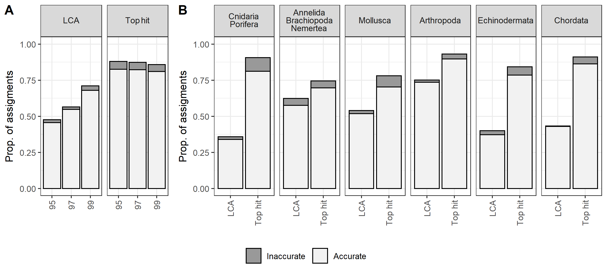

# Manuscript repository for:  Maximizing the reliability and the number of species assignments in metabarcoding studies

__Main author:__  Audrey Bourret  
__Affiliation:__  Fisheries and Oceans Canada (DFO)   
__Group:__        Laboratory of genomics   
__Location:__     Maurice Lamontagne Institute  
__Affiliated publication:__ Audrey Bourret, Claude Nozères, Éric Parent, Geneviève J. Parent (in prep). *Maximizing the reliability and the number of species assignments in metabarcoding studies*   
__Contact:__      audrey.bourret@dfo-mpo.gc.ca

- [Objective](#objective)
- [Status](#status)
- [Contents](#contents)
- [Main Results](#main-results)
- [Requirements](#requirements)
- [Caveats](#caveats)
- [Uncertainty](#uncertainty)
- [Acknowledgements](#acknowledgements)
- [References](#references)

## Objective

The objective of this study was to estimate the accuracy of species assignments using a public repository (NCBI-nt) and identified the methods that were optimal with a public repository or a regional library. In this repository, you will find R script and results associated with the manuscript.

## Status
"Ongoing-improvements"

## Contents

### Folder structure

    .
    ├── 00_GSL_library     #  
    ├── 01_Raw_data        # 
    ├── 02_Code            # R scripts 
    ├── 03_Results         # Main figures     
    └── README.md

## Main results

|  |
|:--:| 
| **Figure 2** Classification of 651 marine faunal species previously observed in the Gulf of St. Lawrence and included in the GSL-rl, by phylum. Species rank categories are based on the similarity and availability of sequences from local and close relative species.|

|  |
|:--:| 
| **Figure 3** Results of taxonomic assignment of sequences from the GSL-rl using NBCI-nt and Blast-LCA or Blast-TopHit methods. Panels A and B present the proportion of accurate and inaccurate species assignments. Results overall taxonomic groups at the three identity thresholds (95%, 97%, 99%; panel A) and by taxonomic group at the 97% threshold (panel B).|

|  |
|:--:| 
| **Figure 4** Results of taxonomic assignment at the species level for the metabarcoding dataset over the GSL-rl and NBCI-nt libraries using IDtaxa (confidence level: 40%, 50% and 60%) and Blast-LCA or Blast+TopHit (identity threshold: 95%, 97% and 99%). Panel A detailed the detections for each species, and panel B synthesize the number of species detections for each library and method. Panel C compared the species rank for all the species detected with the two libraries. Species rank categories are based based on the similarity and availability of sequences from local and close relative species for the GSL-rl and on the geographic or habitat plausibility for the NCBI-nt. |

